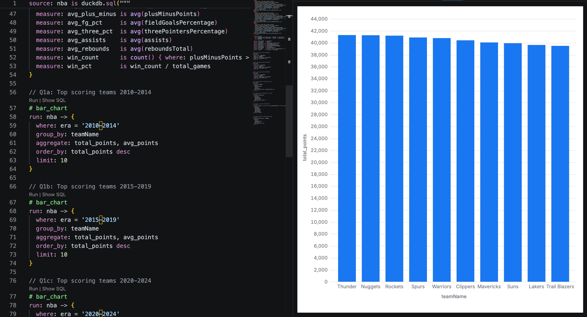

# nba-malloy-project
Historical NBA database

By completing this project, I improved my understanding of Malloy and improved my ability to explore data and extract meaning. I expanded this project beyond what I had previously done with Malloy, using 3 separate CSV files and pulling data from them simultaneously. This was new to me, so it took a bit of troubleshooting, but I used AI to work through my issues and eventually was able to query all the files. It was also helpful that the files were all formatted in the same way, because I initially had one file that had different column headings, which I deemed unnecessary because it was somewhat inconsistent with the data I was already using.

### Question 1: Which teams scored the most points in each era (2010–2014, 2015–2019, 2020–2024)?

I ended up splitting my first query into three separate queries to make it easier to see clearly which teams scored the most points in each era, ordering each by total points. I was expecting to see the number of points scored by the highest scoring team increase between each era, but I found it interesting that the Bucks, who scored the most between 2020 and 2024, had scored significantly fewer points than the Rockets, who were the highest scoring team between 2015 and 2019. I quickly realized that this is likely because the NBA season was suspended due to COVID, resulting in fewer games overall. It was interesting to see which teams dominated in points rather than wins, although it seems to be mostly consistent with which teams had high winning records in each era.

### Question 2: Which teams have the best plus/minus and win percentage across all seasons — who are the most dominant franchises overall?

For my second query, I ordered first by win percentage and then by average plus minus to determine the most dominant teams between 2010 and 2024. There is a clear correlation between points and wins, but I was especially surprised by the Mavericks, who had a significantly lower plus minus compared to teams with similar win percentages. This means that they likely won a significant number of games by a small margin, and they could have lost some games by large deficits.

### Question 3: Has the NBA gotten higher scoring over time? Have 3-point percentages and assists also trended up season by season?

To explore the relationship between year and stats like 3-point percent and assists, I grouped the data by season and aggregated points, three percentage, and assists. Generally speaking, all three of the stats that I focused on improved season to season. 2010-2011 was an outlier; average points was significantly higher than the following seasons, and the other two metrics were also lower in following years. I don’t have a concrete explanation for the discrepancy, but consistently higher stats suggest a notable difference in performance.

### Question 4: What do winning games look like statistically vs losing games?

For this query, I compared how important points, field goal percentage, three percentage, assists, and rebounds are to winning. As expected, each of the metrics I chose to show were higher when teams won; There were not any surprises looking at this data.

### Question 5: Which teams were the most dominant in a single season, based on highest win percentage and average plus/minus?

To answer this question I ordered the results by win percentage. I found it interesting that some seasons had multiple teams with record high win percentages, reflecting a larger imbalance in wins in these seasons. The rest of the data was unsurprising; teams always had positive average minus stats and performed well in all other areas.

### So what?

This information would be useful when projecting scores and performances for upcoming games or seasons. Taking into account historical data and trends, this data might be able to give valuable insight and help set lines for sports betting purposes. These findings might also be interesting to anyone who is interested in historical NBA performance. I had no real useful motive for working with this dataset, but I found it interesting to see how different performance metrics behaved relative to each other. Simply playing around with the data and querying without a narrow goal can provide valuable new viewpoints into which statistics are really important when it comes to winning.

## Data Source

[NBA Data 2010–2024](https://github.com/NocturneBear/NBA-Data-2010-2024) 
by NocturneBear
